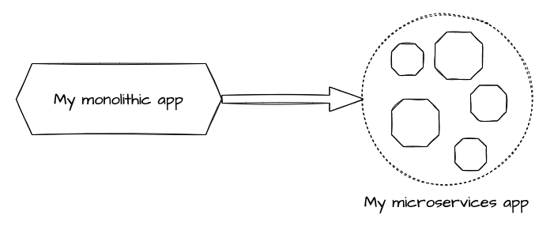
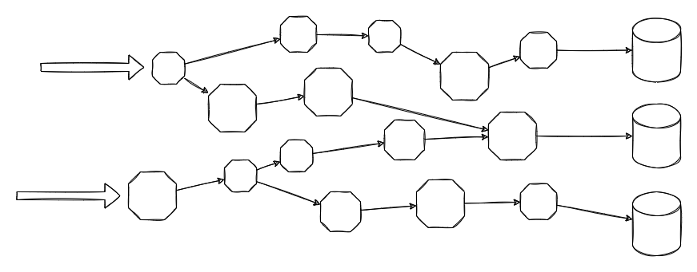
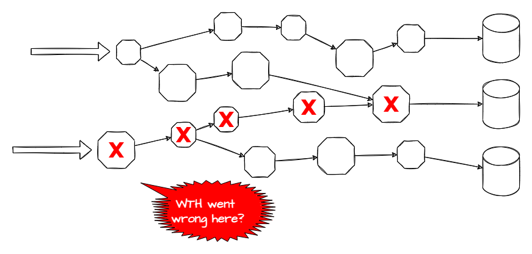
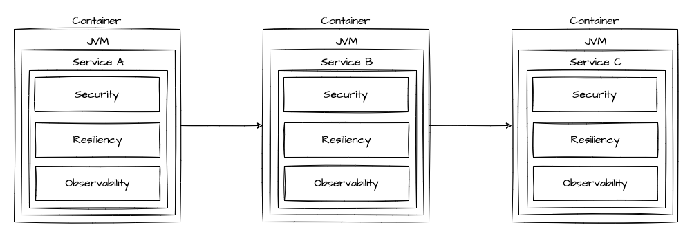
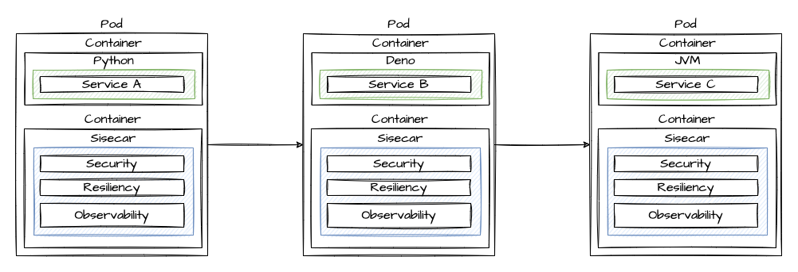
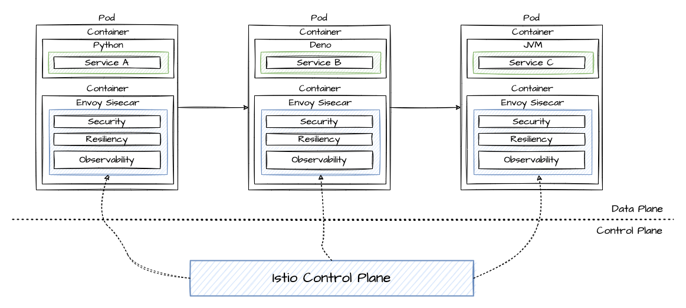
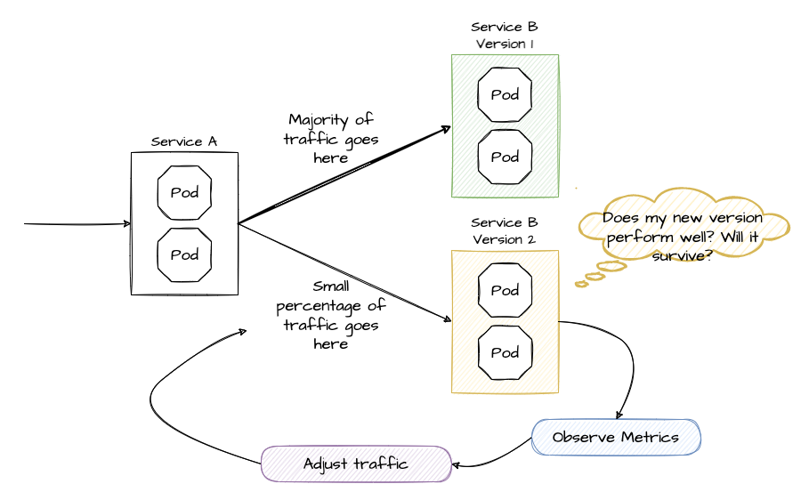
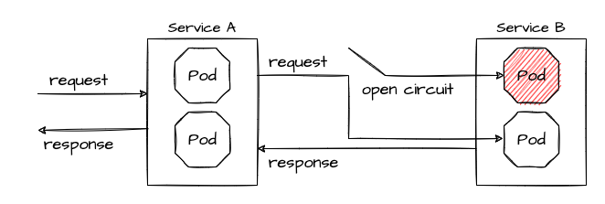

# Open Tour 2022 - Service Mesh

In this workshop we'll have a look at how a Service Mesh can help us to enhance the Security, Observability and Resiliency of our microservices. And all that without the need to add any libraries (say Goodbye to Spring Cloud) or to write infrastructure-related code.

## Microservice architectures

After some success and some more challenges with monolithic applications, platforms like Kubernetes and Microservice architectures came to our rescue. Greenfield apps are developed in microservices now, and existing monoliths (aka legacy apps) are converted into microservices.



Over time, our microservice app quickly evolves to a network of microservices:



And it becomes increasingly difficult to locate failures and achieve resiliency.



Obviously, at this stage, we have to do something for better Security, Observability and Resiliency:

* All traffic should be secure (mTLS)
* We want to have information about health, requests, error rates, transactions, distributed traces and so on
* We want to avoid the [Fallacies of Distributed Computing](https://en.wikipedia.org/wiki/Fallacies_of_distributed_computing) by implementing Resiliency pattern like Circuit Breaker, Retries and Timeouts

### Embedding capacities in our microservices

Service Registries and Config Server were needed to keep the fleet of microservices under control, libraries like Netflix Hystrix, the Feign Client, Sleuth etc. (most of them very soon bundled in Spring Cloud for easy usage in Spring Boot applications) came to the rescue and helped us to implement patterns for Resiliency and Observability. 



**It works, but it's not the perfect solution:**

* Lots of libraries
* Infrastructure-related code needed but we want to focus on business functionality
* Libs in other languages than Java - e.g. Python, Ruby, JavaScript/NodeJS - maybe not available or behaving differently

Let's move forward to make it better by using a Service Mesh!

### Istio and Envoy

There are several service meshes available for Kubernetes, including Istio and Envoy, Linkerd, Consul. We work with the Red Hat OpenShift Service Mesh, which is based on Istio and Envoy.

### The Sidecar

The Sidecar pattern offloads functionality from application code to the Service Mesh.



### Control Plane and Data Plane

As we've bundled all the features for Observability, Security and Resiliency in a Sidecar, we can use the Control Plane to configure the sidecars.



## The sample apps

I created 3 sample apps, called Service A, B and C.

* Service A: Python app which calls Service B
* Service B: TypeScript/Deno app which calls Service C
* Service C: Java app with endpoints to simulate failures

To play with the apps, just run the podman-compose file ('podman-compose up --build' - also works with Docker Compose) and call service-a on localhost:3000 to see the call hierarchy. service-c (port 3002) has endpoints to activate ('/crash') and deactivate ('/repair') error mode.

Then let's move forward to Kubernetes / OpenShift. If you don't have access to an OpenShift cluster, just use [OpenShift Local](https://developers.redhat.com/products/openshift-local/overview). You can also run the apps and use cases with other K8s distributions, for example Minikube on your local machine. However, not all Service Mesh functionality may be available and Ingress may behave differently. The installation will be different to the instructions in the following section. Just check the documentation of your preffered K8s.

## OpenShift Service Mesh preparation

See [OpenShift Docs](https://docs.openshift.com/container-platform/4.11/service_mesh/v2x/installing-ossm.html)

Install in order:

* **OpenShift Elasticsearch**  
Namespace: openshift-operators-redhat
* **Red Hat OpenShift distributed tracing platform**  
Namespace: openshift-distributed-tracing
* **Kiali**  
Namespace: openshift-operators
* **Red Hat OpenShift Service Mesh**  
Namespace: openshift-operators

Then:

* Create "istio-system" namespace
* Install ServiceMeshControlPlane (istio/controlplane.yml)
* Create ServiceMeshMemberRoll (istio/memberroll.yml)

## Using the Service Mesh

### Deploy the sample apps

In your apps project, deploy the sample apps:

```sh
oc create -f https://raw.githubusercontent.com/nikolaus-lemberski/opentour-2022-servicemesh/main/kubernetes/a-deploy.yml
oc create -f https://raw.githubusercontent.com/nikolaus-lemberski/opentour-2022-servicemesh/main/kubernetes/b-deploy.yml
oc create -f https://raw.githubusercontent.com/nikolaus-lemberski/opentour-2022-servicemesh/main/kubernetes/c-v1-deploy.yml
oc create -f https://raw.githubusercontent.com/nikolaus-lemberski/opentour-2022-servicemesh/main/kubernetes/c-v2-deploy.yml
```

Check the pods - all pods should be running and you should see in the READY column "2/2". Why 2? In the pod are 2 containers - one for the app and one for the Envoy Sidecar.

### Create a Gateway for Ingress

Now we create a Gateway and expose our service-a.

```sh
oc create -f https://raw.githubusercontent.com/nikolaus-lemberski/opentour-2022-servicemesh/main/kubernetes/gateway.yml
oc get route istio-ingressgateway -n istio-system

ROUTE=...
curl $ROUTE/service-a
```

If the services respond correctly, continue.

## Canary Releases

Traffic shaping allows us to release new software versions as "Canary releases" to **avoid the risk of a Big Bang / All at Once approach**. This is the first use case we'll have a look at.

### What is a Canary Release?

With a Canary Release you deploy the new version of your app to production but you keep the former version and you send only a small set of users to the new version. If the new version performs well and as expexted, you send more traffic to the new version. If 100% traffic goes to the new version, you can scale down and remove the former version.



There are lots of options, how to adjust the traffic, for example by user group, location and so on. Here we just use a simple approach by defining the percentage of traffic for each version.

### Apply the Canary Release

We already have two versions of service-c deployed. At the moment the traffic goes 50%/50%, the default "round robin" behavior of service routing in Kubernetes.

With a Service Mesh, we can finetune this behavior. First we inform the Service Mesh about our two versions, using a _DestinationRule_:  
`oc create -f https://raw.githubusercontent.com/nikolaus-lemberski/opentour-2022-servicemesh/main/kubernetes/destination-rules.yml`

Then we can start to shift the traffic. Open 2 terminals. 

**Terminal 1:**
```sh
ROUTE=...
while true; do curl $ROUTE/service-a; sleep 0.5; done
```

**Terminal 2:**
1. 100% traffic goes to our "old" version 1  
`oc create -f https://raw.githubusercontent.com/nikolaus-lemberski/opentour-2022-servicemesh/main/kubernetes/canary/1-vs-v1.yml`
2. We start the canary release by sending 10% of traffic to version 2  
`oc replace -f https://raw.githubusercontent.com/nikolaus-lemberski/opentour-2022-servicemesh/main/kubernetes/canary/2-vs-v1_and_v2_90_10.yml`
3. We are happy with version 2 and increase the traffic to 50%  
`oc replace -f https://raw.githubusercontent.com/nikolaus-lemberski/opentour-2022-servicemesh/main/kubernetes/canary/3-vs-v1_and_v2_50_50.yml`
4. Finally we send 100% of the traffic to version 2  
`oc replace -f https://raw.githubusercontent.com/nikolaus-lemberski/opentour-2022-servicemesh/main/kubernetes/canary/4-vs-v2.yml`

While applying steps 1-4, check Kiali and Jaeger. Here you have great Observability without any libraries or coding*. You can open Jaeger and Kiali from the OpenShift Console (Networing Routes).

_(*) The Envoy Sidecar automatically injects tracing headers and sends traffic metadata to Kiali and Jaeger. For the Distributed Tracing, you must propagate the tracing headers when doing calls to other services. See [Istio Header Propagation](https://istio.io/latest/docs/tasks/observability/distributed-tracing/overview/)._

### Circuit Breaker and Retry

Circuit Breaker and Retries are pattern Resiliency pattern. A circuit breaker blocks traffic to a slow or non-performing service, so the app can (hopefully) recover. This is to prevent cascading failures, a commen scenario if for example Thread Pools are running full while all requests wait for an unresponsive service.

A circuit breaker reduces the number of errors that are propagated to the end user and prevent cascading failures. With Retry policies we can eliminate almost all. If an error occurs or the service call is too slow, the Retry policy will try the service call again, is routed to another app instance and the request is processed successfully.



Let the terminal with the curl loop running or open a new one.

**Terminal 1:**
```sh
ROUTE=...
while true; do curl $ROUTE/service-a; sleep 0.5; done
```

In Terminal 2, let's reset the VirtualService from our former Canary release and scale the service-c-v1 down to zero replicas and service-c-v2 up to 2 replicas.

**Terminal 2:**
```sh
oc replace -f https://raw.githubusercontent.com/nikolaus-lemberski/opentour-2022-servicemesh/main/kubernetes/circuit-breaker/1-vs.yml
oc scale deploy/service-c-v1 --replicas 0
oc scale deploy/service-c-v2 --replicas 2
```

Now connect to service-c and let it crash... in a separate terminal, run

**Terminal 3:**
```sh
oc get pod
POD_NAME=....
oc port-forward pod/$POD_NAME 8080:8080
```

Let the port-forwarding of Terminal 3 open, go back to Terminal 2 and let one app of service-c crash:  
`curl localhost:8080/crash`

See what happens in Terminal 1 with the curl loop.

Now apply the Circuit Breaker (check what happens), then the Retry policy.

**Terminal 2:**  
`oc replace -f https://raw.githubusercontent.com/nikolaus-lemberski/opentour-2022-servicemesh/main/kubernetes/circuit-breaker/2-destination-rules.yml`

Better, but still some errors. Let's apply the retry policy.

**Terminal 2:**  
`oc replace -f https://raw.githubusercontent.com/nikolaus-lemberski/opentour-2022-servicemesh/main/kubernetes/circuit-breaker/3-vs-retry.yml`

Finally repair the crashed service.

**Terminal 2:**  
`curl localhost:8080/repair`

After ~10 seconds the repaired pod gets traffic (Circuit Breaker goes from open to close).

**Congratulations, you made it!!**
